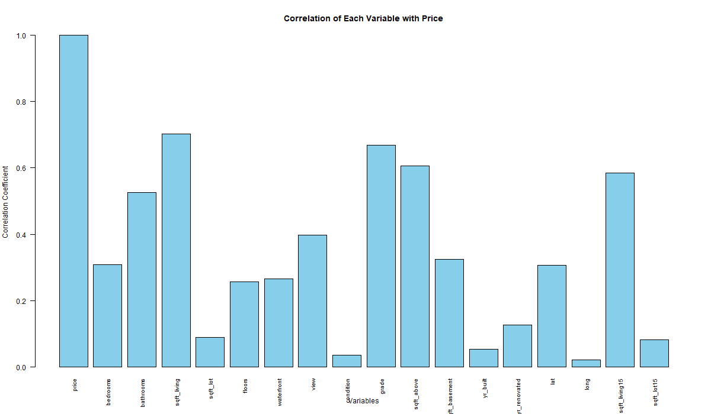
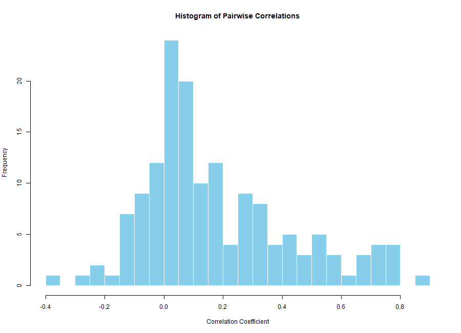
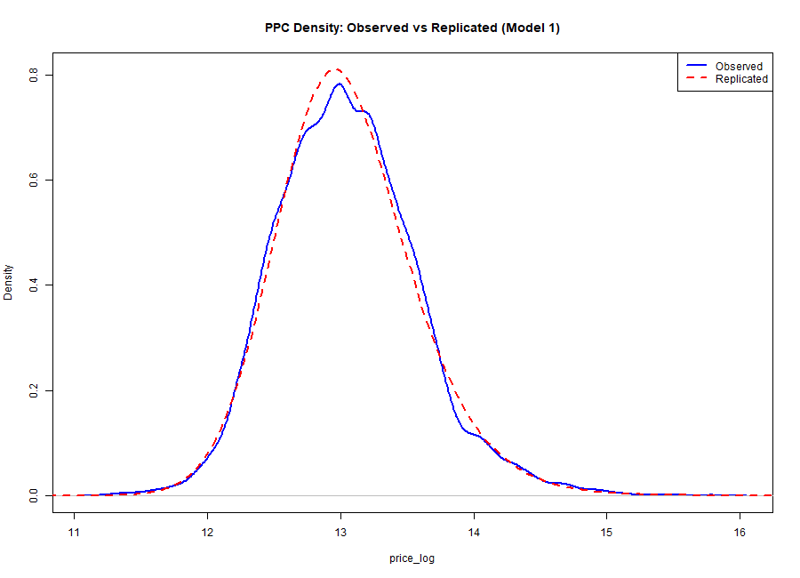
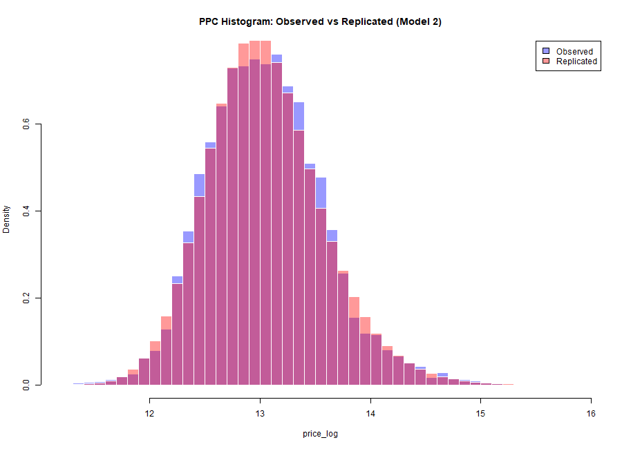
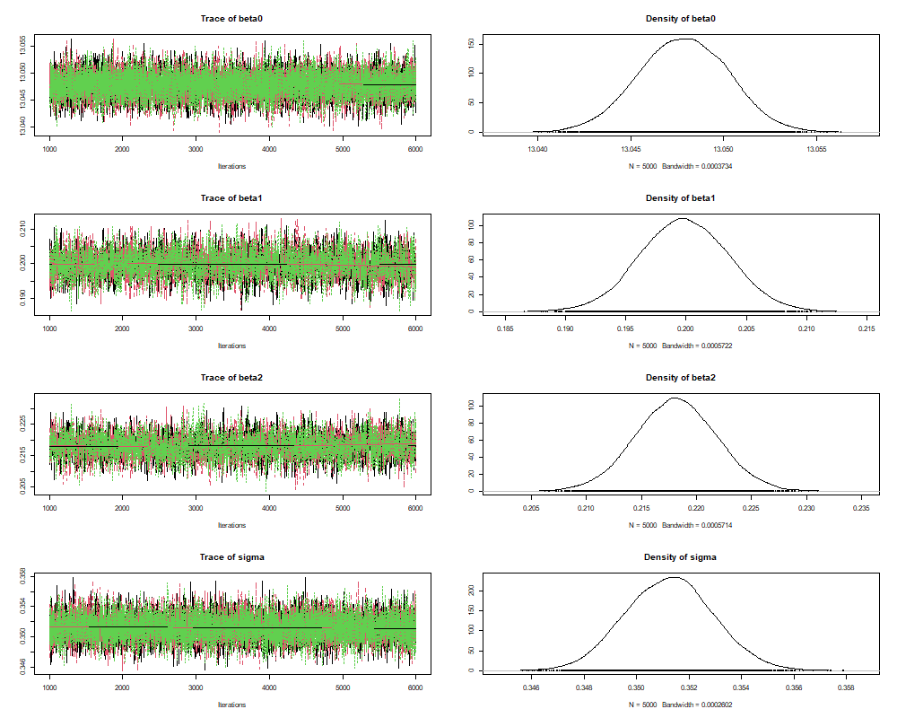
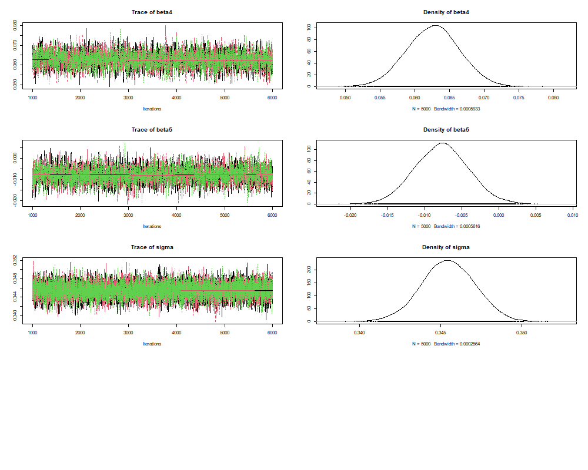

# 🏠 Bayesian House Price Modeling with JAGS

This project analyzes the **King County House Sales dataset** (`kc_house_data.csv`) using **Bayesian regression models in R with JAGS**.  
The goal is to model housing prices, visualize data, and compare models using posterior predictive checks (PPC) and Deviance Information Criterion (DIC).

---

## 📂 Project Structure
- **Data Exploration**  
  - Histograms for all numeric variables  
  - Correlation analysis with price  

   ### Correlation Plots



- **Data Preparation**  
  - Log-transform of skewed variables (`price`, `sqft_living`, etc.)  
  - Scaling predictors for regression  

- **Modeling**  
  - **Model 1**: Simple regression (`sqft_living`, `grade`)  
  - **Model 2**: Extended regression (`sqft_living`, `grade`, `sqft_above`, `sqft_living15`, `bathrooms`)  
  - Bayesian estimation with JAGS  
  - Posterior summaries for parameters  
  - Posterior predictive checks (log scale & price scale)  

- **Model Comparison**  
  - Compare Bayesian models with frequentist OLS regression  
  - Use DIC for Bayesian model selection  

---
## 📊 Key Outputs

### Correlation Plots


### Posterior Predictive Checks

#### Model 1



#### Model 2




### Trace Plots





## 🚀 How to Run
```bash
git clone https://github.com/yourusername/house-price-bayes.git
cd house-price-bayes

